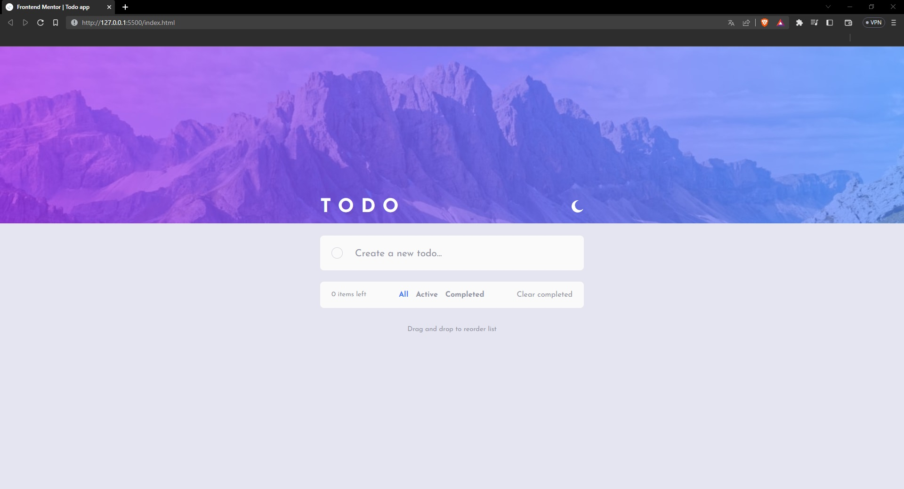
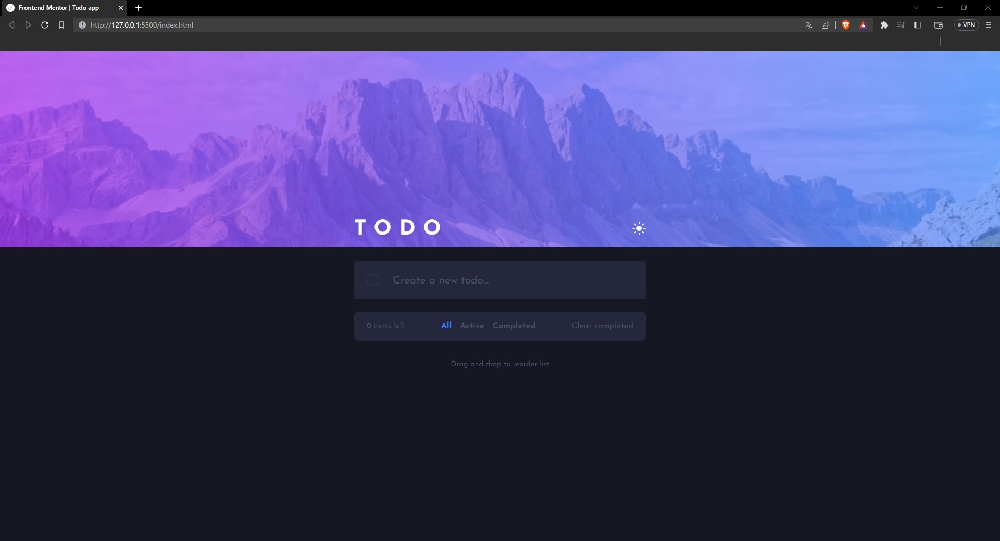

# Frontend Mentor - Todo app solution

This is a solution to the [Todo app challenge on Frontend Mentor](https://www.frontendmentor.io/challenges/todo-app-Su1_KokOW). Frontend Mentor challenges help you improve your coding skills by building realistic projects. 

## Table of contents

- [Overview](#overview)
  - [The challenge](#the-challenge)
  - [Screenshot](#screenshot)
  - [Links](#links)
- [My process](#my-process)
  - [Built with](#built-with)
  - [What I learned](#what-i-learned)
  - [Continued development](#continued-development)
  - [Useful resources](#useful-resources)
- [Author](#author)

## Overview

### The challenge

Users should be able to:

- View the optimal layout for the app depending on their device's screen size
- See hover states for all interactive elements on the page
- Add new todos to the list
- Mark todos as complete
- Delete todos from the list
- Filter by all/active/complete todos
- Clear all completed todos
- Toggle light and dark mode
- **Bonus**: Drag and drop to reorder items on the list

### Screenshot

### Links

- Solution URL: [FrontEnd Solution]([https://www.frontendmentor.io/solutions/todoapp-CQAX6lwb2j])
- Live Site URL: [Live Site]([https://your-live-site-url.com](https://lozocz.github.io/URL-shortening-API-landing-page/])

## My process

### Built with

- Semantic HTML5 markup
- CSS custom properties
- Flexbox
- CSS Grid
- Mobile-first workflow
- Vanilla JS

### What I learned

I learned new events in addEventListener, namely dragover, dragstart, dragend and dragenter

### Continued development

In future projects, I want to focus on new and simpler ways to expand each element of the site and on the use of JS and CSS libraries.

### Useful resources

- [YouTube](https://www.youtube.com/watch?v=9HUlUnM3UG8) - This helped me to understand the transfer of elements by dragging

## Author

- Frontend Mentor - [@LoZoCz](https://www.frontendmentor.io/profile/LoZoCz)
